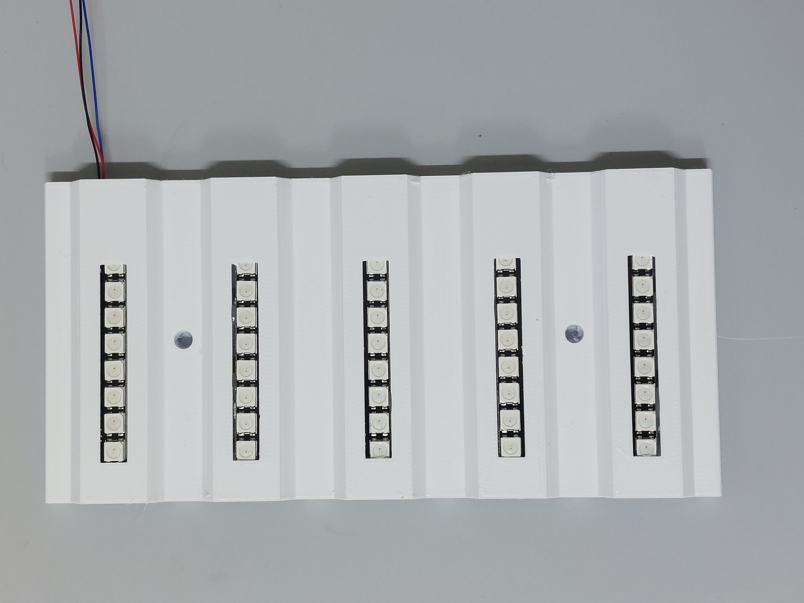

# Opto-Box-v2
A versatile device for optogenetic manipulations in groups of flies 

## Description

The opto-box is a device for optogenetic activation or silencing in groups of adult fruit-flies. It has an Arduino at its heart which controls a number of WS2812B RGB LEDs. It uses off the shelf components and (almost) fully 3D printed. Ignoring the print times the device can be assembled over a weekend. It represents a significant improvement (not just in terms of looks) over an earlier iteration. The device can function as a standalone unit once the user inputs(colour of light, intensity, frequency, duration) have been input through the serial monitor.

You can find out more by checking out the [Hackaday page](https://hackaday.io/project/202137-opto-box-v2) for this project.

## Introduction

Optogenetics is the use of light to control some aspect of biology in a living system. My previous project gives a short intro on how this tool is leveraged in Drosophila especially in the context of neuroscience research so I will not go into that here. The reason for building this device was that there were no commercial solutions to our problem. In the lab, we study the role of sleep in memory consolidation(among other things). Our memory assays use groups of flies and that means we have to perform optogenetic manipulations uniformly in as many as 100 flies per vial. To my knowledge there are no commercial systems that do this. This is where the Opto Box comes in. Here is the first iteration of it. 

The v2 is more modular. It is not shoddily held together with hot glue like its predecessor and things can be replaced if the need arises. 

Both of them use the WS2812B LEDs. These come in a variety of forms- single SMD chips, strips, circular modules, 8x8 squares, 8 in-line straight modules, there is even a flexible one. I used the 8 LED straight module as this gives ample coverage over the region of the culture tube (excluding the media and the plug). These are RGB LEDs so they can be used with different optogenetic effectors like Chrimson(Red), channelrhodopsin (blue), or GtAcRs(green) although we have only tried it with Chrimson and GtAcR1. Another benefit is that these can be daisy chained and it is possible to hook up multiple of these modules in series. There is a nice FastLED library for Arduino written by Daniel Garcia that makes controlling the LEDs very easy. The intensity, colour, switching on/off can all be done by software unlike regular RGB leds. This eliminates the need for a complicated circuity. The downside is that the intensity is lower than that of 12V RGB leds so it might not work for some applications. We haven't measured the actual light output with a probe because we do not have a probe that is small enough to fit inside. 

The WS2812B leds are daisy chained in each panel. Since there are four of these panels, they all share the data line. The Arduino "thinks" there are only 40 leds(8x5) but in fact there are 120. The reason for not connecting the panels linearly(thereby daisy chaining all 120 leds) is to reduce communication time. Instead, the connections branch off to the four panels i.e. the wires connect to a screw terminal block on the perfboard.. We do not need the leds to be individually addressable but if all of them are connected linearly then the last (120th) led will take a significant amount of time to respond and this might be an issue when using high stimulation frequencies.

This is a schematic of the circuit. 

## Operation

The Opto Box is hooked up to a 9V or 12V 2A DC adapter. The power indicator should light up and there is an initial beep. This should be done **before** connecting the Arduino to the computer. The Arduino inside is then connected to a laptop. Inputs are given through the serial monitor of the Arduino IDE. Once the programming is done the laptop can be disconnected. Make sure that the power indicator is on before starting the stimulation . If the stimulation starts without external power, the Arduino will try to power the LEDs on its own which might damage components on the board. (Maybe the v3 will not have this problem!)
